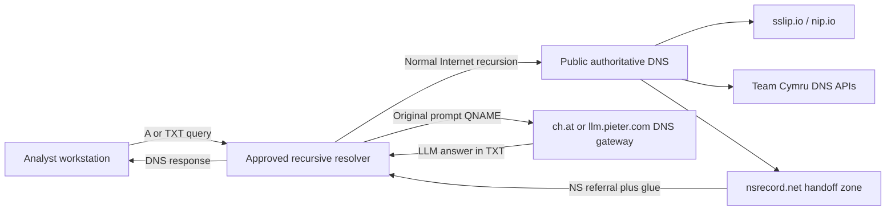

# Recursive DNS OOB Lab v2

This small purple-team lab demonstrates an easy-to-miss network-boundary fact:
a workstation may have no direct web access and no permission to contact public
DNS servers, yet its approved recursive DNS resolver can still reach dynamic
authoritative services on its behalf.

The lab uses only ordinary DNS queries and currently available public services.
It requires no account, domain registration, API key, cloud instance, or custom
authoritative server.

> **Please keep this a lab.** Run it only from systems and networks where you
> have permission to test. DNS queries are plaintext, routinely logged, and
> often cached. Use synthetic prompts, public IP addresses, and public sample
> hashes only—never credentials, internal names, customer data, or secrets.

The lab implementation is [`dns_oob_lab_v2.py`](./dns_oob_lab_v2.py).

## What you will learn

By the end of the exercise, you should be able to explain and observe:

- the difference between a DNS client, recursive resolver, and authoritative
  nameserver;
- how an `NS` delegation and its glue address direct a resolver to another
  server;
- how `A`, `TXT`, `NS`, and negative DNS responses are used;
- why an internal resolver can become an indirect egress path;
- how DNS caching, timeouts, label limits, and response sizes affect the path;
- what endpoint, resolver, and perimeter telemetry can detect the activity.

The script is deliberately a demonstration, not a general-purpose tunnel. It
does not transfer files, fetch arbitrary URLs, open a shell, or execute returned
content.

## Lab topology



The important detail is that the workstation talks only to its configured
recursive resolver. The resolver performs the public DNS traversal.

## Requirements

- Python 3.9 or newer
- The [`dnspython`](https://www.dnspython.org/) package
- Access to an approved recursive resolver
- Permission to run the exercise

From PowerShell:

```powershell
python --version
python -m pip install dnspython
```

An optional virtual environment keeps the dependency local to the exercise:

```powershell
python -m venv .venv
.\.venv\Scripts\Activate.ps1
python -m pip install dnspython
```

## Quick start

### 1. Review the available options

```powershell
python .\dns_oob_lab_v2.py --help
```

### 2. Use the operating system's configured resolver

```powershell
python .\dns_oob_lab_v2.py
```

This is normally the right starting point. In a managed lab, the operating
system should already point at the internal resolver.

### 3. Select the lab resolver explicitly

```powershell
python .\dns_oob_lab_v2.py --resolver 10.214.0.2
```

Replace `10.214.0.2` if your exercise provides a different resolver address.
Do not substitute a public resolver merely to make the test pass: if direct
DNS egress is supposed to be blocked, using the internal resolver is the point
of the exercise.

### 4. Run only the deterministic phases

```powershell
python .\dns_oob_lab_v2.py --resolver 10.214.0.2 --skip-llm
```

This runs the resolver, wildcard-DNS, ASN, and malware-hash checks without
contacting a public DNS-backed LLM.

### 5. Supply a single synthetic prompt

```powershell
python .\dns_oob_lab_v2.py `
  --resolver 10.214.0.2 `
  --workers 1 `
  --prompt "explain dns recursion in one sentence"
```

Repeat `--prompt` to submit several prompts:

```powershell
python .\dns_oob_lab_v2.py `
  --resolver 10.214.0.2 `
  --prompt "name three dns record types" `
  --prompt "what is an authoritative nameserver"
```

Concurrency is intentionally limited to four workers. These are public
research and hobby services, so please be a considerate guest.

### 6. Change the deterministic lookup inputs

```powershell
python .\dns_oob_lab_v2.py `
  --resolver 10.214.0.2 `
  --lookup-ip 1.1.1.1 `
  --hash 8a62d103168974fba9c61edab336038c `
  --skip-llm
```

The default hash is a public example from Team Cymru's documentation. No file
or malware sample is downloaded.

### 7. Test resolver fallback outside a restricted lab

Multiple `--resolver` arguments are tried in order for transient failures:

```powershell
python .\dns_oob_lab_v2.py `
  --resolver 8.8.8.8 `
  --resolver 9.9.9.9
```

This is useful on an ordinary test network. It is usually inappropriate inside
the restricted exercise because the expected route is through the designated
internal resolver.

## What each phase demonstrates

### Phase A: resolver and recursive reachability

Phase A starts with basic controls:

1. `example.com A` confirms that the selected resolver answers a known public
   name.
2. A random name under the reserved `.invalid` top-level domain confirms that
   negative responses are handled correctly.
3. `198-51-100-24.sslip.io A` returns `198.51.100.24`. The address is encoded
   in the name, and the authoritative service generates the answer.
4. `ip.nip.io TXT` shows the source address seen by the authoritative server.
   Through recursion, this is normally an address belonging to the recursive
   resolver—not the analyst workstation.

That final result is particularly useful in a purple-team exercise: it makes
the intermediary role of the recursive resolver visible.

### Phase B: deterministic data services over DNS

The [Team Cymru IP-to-ASN service](https://www.team-cymru.com/ip-asn-mapping)
maps an input address to routing information. For `8.8.8.8`, the QNAME is:

```text
8.8.8.8.origin.asn.cymru.com TXT
```

The octets are reversed in the general IPv4 case, similar to other DNS-based
lookup lists. A response includes the origin ASN, BGP prefix, registry country,
registry name, and allocation date. The script then queries the corresponding
ASN description.

The [Team Cymru Malware Hash Registry](https://hash.cymru.com/docs_dns) accepts
MD5, SHA-1, and SHA-256 indicators:

```text
8a62d103168974fba9c61edab336038c.hash.cymru.com A
8a62d103168974fba9c61edab336038c.hash.cymru.com TXT
```

A recognized hash returns `127.0.0.2` for the `A` query. The `TXT` answer adds
a last-seen timestamp and antivirus detection percentage. An absent indicator
normally returns `NXDOMAIN`—that is a valid negative result, not necessarily a
network failure.

This phase is handy because it is predictable, security-relevant, and does not
depend on generative output.

### Phase C: dynamic delegation to an LLM-over-DNS gateway

This phase reproduces the interesting two-service chain from the exercise
without registering anything.

Suppose `ch.at` currently resolves to `34.28.5.90`. The script changes this:

```text
what is the capital of france
```

into a DNS-safe name resembling:

```text
what-is-the-capital-of-france.lab.34-28-5-90.handoff.nsrecord.net
```

The flow is:

1. The script resolves the public DNS LLM gateways `ch.at` and
   `llm.pieter.com` through the selected recursive resolver.
2. It converts spaces and punctuation in the synthetic prompt to DNS-safe
   hyphens and labels.
3. It embeds the selected gateway's IPv4 address in a name under
   [`handoff.nsrecord.net`](https://nsrecord.net/).
4. `nsrecord.net` returns an `NS` referral plus glue directing the recursive
   resolver to the embedded address.
5. The recursive resolver sends the original `TXT` question to that public DNS
   gateway.
6. The gateway obtains an LLM response and returns it as TXT data.
7. The recursive resolver relays the answer to the workstation.

The fixed `lab` label is not decoration: the hosted handoff service delegates
queries that contain at least two labels before the embedded IP address. It
also makes the lab traffic easy to recognize in logs.

If the first gateway fails, the script tries the second gateway. This improves
the demonstration, but public services can still be unavailable, rate-limited,
or changed without notice.

## DNS concepts in plain language

### Stub client, recursive resolver, and authoritative server

- A **stub client** is the small DNS component on the workstation. It normally
  asks one configured resolver for a complete answer.
- A **recursive resolver** does the legwork: root, top-level domain, and
  authoritative lookups. It caches what it learns and returns the final answer.
- An **authoritative server** owns the answer for a zone. It does not need to be
  a static database; software can generate a response dynamically from the
  QNAME, query type, or source address.

The dynamic behavior in this lab occurs on public authoritative services. The
recursive resolver is behaving normally—it is simply following delegations.

### Resource record types

| Type | Number | Normal purpose | Use in this lab |
|---|---:|---|---|
| `A` | 1 | Map a name to an IPv4 address | Reachability, embedded-IP mapping, and malware-hash membership |
| `NS` | 2 | Identify a zone's authoritative server | Hand the prompt namespace to the DNS LLM gateway |
| `SOA` | 6 | Describe a zone and negative-caching policy | Often appears in negative responses |
| `TXT` | 16 | Publish text or protocol-specific data | ASN metadata, hash metadata, and LLM answers |

TXT is not inherently suspicious. SPF, DKIM, DMARC, domain verification, ACME,
and many security products use it legitimately.

### Delegation, referrals, and glue

An `NS` delegation says, roughly, “ask this other server about the child zone.”
The response is a **referral**, not the final application answer.

The resolver also needs the delegated server's address. A **glue record** is an
address included with the referral so the resolver can reach the next server
without getting stuck in a circular lookup. `nsrecord.net` generates both the
referral and glue from the IP encoded in the query name.

### QNAMEs, labels, and limits

The queried domain name is the **QNAME**. Dots divide it into labels.

- Each label is limited to 63 octets.
- A complete textual domain name is effectively limited to 253 characters
  without its final root dot.
- DNS names are case-insensitive, so an encoding that depends on uppercase and
  lowercase being distinct is a poor fit.

The script normalizes prompts to ASCII, replaces punctuation with hyphens,
splits long input across legal labels, and rejects names that exceed the full
DNS limit.

### UDP, TCP, response size, and latency

Most ordinary DNS begins over UDP. Larger responses may use EDNS or be marked
truncated, causing a retry over TCP. A firewall that permits UDP/53 but blocks
TCP/53 can therefore break large TXT answers.

DNS normally answers quickly; an LLM may need several seconds. The script uses
a 30-second default lifetime and reports elapsed time. Slow answers are also a
valuable detection signal.

### Caching and TTL

Recursive resolvers cache answers for their advertised time-to-live (`TTL`). A
repeated prompt may therefore return immediately without reaching the public
gateway again. This is expected DNS behavior.

Caching is useful operationally but matters during validation: distinguish a
fresh authoritative interaction from a cached response. Do not defeat caches
by generating large volumes of random prompts against a public hobby service.

### Useful response states

| Result | Meaning |
|---|---|
| `NOERROR` with answers | The lookup succeeded and returned the requested data |
| `NODATA` | The name exists, but there is no record of the requested type |
| `NXDOMAIN` | The queried name does not exist; sometimes an expected negative result |
| `SERVFAIL` | A resolver or authoritative dependency could not complete the lookup |
| Timeout / `ERROR` | No usable response arrived within the configured lifetime |

## How to detect it

A firewall watching only the analyst workstation may see nothing except DNS to
the approved internal resolver. Detection therefore works best by correlating
endpoint and recursive-resolver telemetry.

### High-confidence indicators for this lab

Look for:

- queries ending in `.handoff.nsrecord.net`;
- `TXT` queries with human-readable prompt-like labels;
- the fixed `.lab.<encoded-ip>.handoff.nsrecord.net` structure;
- referrals whose nameserver address matches an IP encoded in the QNAME;
- subsequent resolver traffic to that dynamically selected DNS server;
- queries to `ch.at` or `llm.pieter.com` near the handoff event;
- multi-second TXT-query latency followed by a relatively large text answer.

The exact suffix is the easiest starting alert for this exercise. Structural
analytics are more durable if another handoff provider appears later.

### General behavioral indicators

- unusually long QNAMEs or many labels;
- a high rate of unique subdomains with poor cache reuse;
- bursts of TXT queries from processes that rarely need TXT data;
- TXT answers substantially larger than the environment's baseline;
- repeated `SERVFAIL`, timeout, or TCP-fallback behavior around TXT queries;
- encoded-looking or prompt-like data before a low-reputation domain suffix;
- authoritative delegations to rapidly changing or previously unseen server
  addresses.

Do not rely only on entropy. Human-readable prompts such as
`explain-dns-recursion` have low entropy but are still unusual DNS labels.

### Suggested detection logic

Product-neutral pseudocode for an initial analytic:

```text
where dns.question.type == "TXT"
  and (
       dns.question.name ends_with ".handoff.nsrecord.net"
       or dns.question.length > 80
       or dns.question.label_count > 7
      )
group by source_host, process, dns.question.name, resolver
include response_code, response_size, response_time, answer_count
```

For this lab, start with an exact domain rule and use the broader conditions in
hunt mode until you understand local false positives.

### Useful telemetry sources

- endpoint DNS events with process attribution;
- recursive resolver query, response, cache, and policy logs;
- packet metadata between clients and approved resolvers;
- resolver egress traffic to authoritative UDP/TCP 53 destinations;
- EDR process telemetry showing Python or another unusual process initiating
  DNS lookups;
- passive DNS or protective-DNS events for newly observed domains and unusual
  record types.

Packet capture at the client-resolver boundary shows the full QNAME because
classic DNS is unencrypted. If the endpoint uses DoH or DoT to the resolver,
the resolver's own logs become even more important.

### False positives to expect

Long or frequent TXT queries can be completely legitimate. Common examples
include:

- `_domainkey` DKIM lookups;
- `_dmarc` policy retrieval;
- SPF and SaaS domain-verification records;
- `_acme-challenge` certificate validation;
- security products using DNS reputation or malware-hash services;
- Team Cymru queries made by this lab or legitimate analyst tooling.

Domain context, originating process, query cadence, and the delegation path are
stronger evidence than record type alone.

### Defensive controls

- Require clients to use approved internal resolvers; block direct external
  UDP/TCP 53 and unauthorized DoH/DoT paths.
- Log the complete QNAME and query type at the recursive layer.
- Use response-policy zones or protective-DNS policy to block known handoff or
  tunneling domains where there is no business requirement.
- Alert on unusual delegations and resolver egress to newly observed
  authoritative servers.
- Rate-limit abusive patterns while preserving normal DNS reliability.
- Do not assume blocking TXT alone solves the problem; other record types can
  carry small responses, and TXT has many legitimate uses.

DNSSEC authenticates DNS data where deployed, but it does not make a legitimate
dynamic authoritative service harmless. This is primarily a policy, monitoring,
and egress-design problem.

## Purple-team validation checklist

Use the lab as a controlled test case:

- [ ] Confirm the workstation sends DNS only to the approved resolver.
- [ ] Confirm the resolver logs the full handoff QNAME and `TXT` type.
- [ ] Observe the `NS` referral and glue generated by `nsrecord.net`.
- [ ] Observe resolver egress to the selected public DNS gateway.
- [ ] Verify the endpoint or EDR associates the lookup with Python.
- [ ] Confirm the detection rule fires and includes enough context to triage.
- [ ] Check whether the answer came from cache or the authoritative service.
- [ ] Apply the intended block and confirm normal business DNS still works.
- [ ] Record false positives and tune by domain, process, and query structure.

## Troubleshooting

### Everything times out

- Verify the resolver address supplied with `--resolver`.
- Confirm the workstation can reach that resolver on UDP and TCP port 53.
- In the restricted lab, use the internal resolver rather than a public IP.
- Ask whether the resolver is permitted to recurse to public authoritative
  servers.

### Phases A and B work, but Phase C fails

This often means dynamic delegation or the public gateway is blocked, slow, or
temporarily unavailable. The script tries both gateways, but neither is an SLA-
backed dependency. Review `SERVFAIL`, timeout, and resolver policy logs.

### `ip.nip.io` returns an unfamiliar address

That is expected. Through recursion, it generally reports the public-facing
address of a resolver node, not the workstation's address.

### A malware-hash query returns `NXDOMAIN`

For the Team Cymru registry, this normally means the hash is not present. It
does not prove that a file is safe.

### A repeated LLM query returns suspiciously quickly

It was probably cached. Check the resolver cache/TTL telemetry or use a small,
new synthetic prompt once. Avoid randomized high-volume tests against public
services.

## References

- [nsrecord.net handoff behavior](https://nsrecord.net/)
- [nip.io / sslip.io wildcard DNS](https://nip.io/)
- [Team Cymru IP-to-ASN service](https://www.team-cymru.com/ip-asn-mapping)
- [Team Cymru Malware Hash Registry DNS API](https://hash.cymru.com/docs_dns)
- [LLM-over-DNS by Pieter](https://llm.pieter.com/)
- [DNSChat](https://www.conhecendotudo.com.br/dnschat/)
- [RFC 1035: Domain Names—Implementation and Specification](https://www.rfc-editor.org/rfc/rfc1035)
- [MITRE ATT&CK T1071.004: DNS](https://attack.mitre.org/techniques/T1071/004/)

Have fun with it—and remember: if the firewall says “no web,” DNS may still be
quietly volunteering for a second job.
