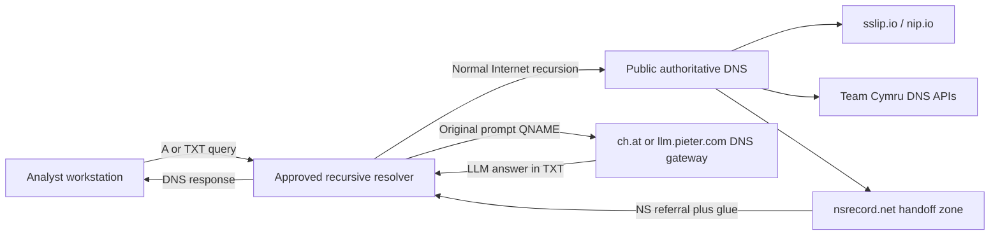

# Recursive DNS OOB Lab v2

This small purple-team lab demonstrates an easy-to-miss network-boundary fact:
a workstation may have no direct web access and no permission to contact public
DNS servers, yet its approved recursive DNS resolver can still reach dynamic
authoritative services on its behalf.

The lab uses only ordinary DNS queries and currently available public services.
It requires no account, domain registration, API key, cloud instance, or custom
authoritative server.

> **Please keep this a lab.** Run it only from systems and networks where you
> have permission to test. DNS queries are plaintext, routinely logged, and
> often cached. Use synthetic prompts, public IP addresses, and public sample
> hashes only—never credentials, internal names, customer data, or secrets.

The lab implementation is [`dns_oob_lab_v2.py`](./dns_oob_lab_v2.py).

If your local folder also contains `dns_oob_lab.py` or
`Purple Team Training Report.md`, those are historical source material, not the
student entry point. The prototype uses older services and a public resolver;
the report includes unverified provider hypotheses. Both remain outside the
published exercise.

## Mission brief

Treat the exercise as a capability ladder, not as three unrelated demos. Each
phase proves one prerequisite before adding another moving part. The endpoint
always sends ordinary DNS queries to the approved recursive resolver; the
interesting behavior happens beyond that resolver.

| Phase | Question | Why it exists | Expected evidence | If it is not observed | What it unlocks |
|---|---|---|---|---|---|
| **A — Recursive path** | Can the approved resolver reach public authoritative DNS? | Establish the network path before testing application behavior. | Public `A` answers, a generated sslip.io answer, and a resolver-egress `TXT` answer. | Suspect the resolver address, client-to-resolver access, recursion policy, or public authoritative reachability. | Confidence that later queries can leave the local DNS boundary through normal recursion. |
| **B — Structured exchange** | Can a QNAME carry caller-controlled input and can DNS records return structured application output? | Separate DNS transport and parsing from the slower, less predictable LLM chain. | Valid ASN/prefix data plus matching positive hash data or paired `NXDOMAIN` replies; negative-response origin remains unverified. | If A worked, investigate filtering, service availability, malformed content, or contradictory replies. | A checked example of input-in-name and structured data-in-answer behavior. |
| **C — Investigate delegated computation** | Can the resolver combine that exchange with a dynamic delegation and external computation? | Investigate generated `NS` handoff, a selected gateway, and a computed answer. | The script checks for nonempty TXT content at a handoff QNAME; students separately assess relevance, delegation, and caching. | If A and B worked, inspect encoding diagnostics, delegation policy, glue handling, gateway reachability, timeout, and public-service availability. | A response to analyze alongside resolver evidence; fresh computation is not automatically verified. |

An inconclusive checkpoint does not stop the script. Later phases still run so
you can collect diagnostic evidence, although their results may be harder to
interpret when an earlier prerequisite was not observed.

## What you will learn

By the end of the exercise, you should be able to explain and observe:

- the difference between a DNS client, recursive resolver, and authoritative
  nameserver;
- how an `NS` delegation and its glue address direct a resolver to another
  server;
- how `A`, `TXT`, `NS`, and negative DNS responses are used;
- why an internal resolver can become an indirect egress path;
- how DNS caching, timeouts, label limits, and response sizes affect the path;
- what endpoint, resolver, and perimeter telemetry can detect the activity.

The script is deliberately a demonstration, not a general-purpose tunnel. It
does not transfer files, fetch arbitrary URLs, open a shell, or execute returned
content.

## Lab topology



The important detail is that the workstation talks only to its configured
recursive resolver. The resolver performs the public DNS traversal.

## Requirements

- Python 3.9 or newer
- The [`dnspython`](https://www.dnspython.org/) package
- Access to an approved recursive resolver
- Permission to run the exercise

From PowerShell:

```powershell
python --version
python -m pip install dnspython
```

### Prepare before entering the restricted lab

Install Python (including pip) and `dnspython` while approved package access is
available. A workstation with web access blocked may be unable to run the
installation command. Package installation is preparation, not part of the
DNS-only demonstration.

For an offline classroom, use a connected preparation environment with the
**same Python version, operating system, and architecture** as the student
environment. Download compatible wheels and transfer the `wheelhouse` folder
with the exercise through your approved distribution method:

```powershell
# Connected preparation environment
python --version
python -m pip download --only-binary=:all: --dest .\wheelhouse dnspython
```

On the student workstation, from the exercise folder:

```powershell
# Offline installation: uses only the supplied wheelhouse
python -m pip install --no-index --find-links .\wheelhouse dnspython
python -c "import dns; print('dnspython', dns.__version__)"
python .\dns_oob_lab_v2.py --help
```

The import and help checks send no lab DNS queries. The instructor should test
this wheel bundle on the classroom image before distributing it. If no
compatible wheel is found, prepare the bundle again in a matching environment.

An optional virtual environment keeps the dependency local to the exercise:

```powershell
python -m venv .venv
.\.venv\Scripts\Activate.ps1
python -m pip install dnspython
```

For offline use, substitute the `--no-index --find-links` installation command
above after activating the environment. If PowerShell blocks activation, use
`.\.venv\Scripts\python.exe` in place of `python` in installation and lab
commands; activation is not required.

## Quick start

### Recommended guided run

Start with one complete run through the approved lab resolver:

```powershell
python .\dns_oob_lab_v2.py --resolver 10.214.0.2
```

Replace `10.214.0.2` if your exercise provides a different resolver address.
Do not substitute a public resolver merely to make the test pass: if direct
DNS egress is supposed to be blocked, using the internal resolver is the point
of the exercise. Read the three introductions as the script runs, inspect each
checkpoint, and finish with the capability-ladder summary. A result of `NOT
OBSERVED` is diagnostic evidence, not a reason to abandon the run.

If your lab intentionally uses the operating system's configured resolver,
omit `--resolver`:

```powershell
python .\dns_oob_lab_v2.py
```

### Optional run variants

Review all available options:

```powershell
python .\dns_oob_lab_v2.py --help
```

Run only the deterministic checkpoints:

```powershell
python .\dns_oob_lab_v2.py --resolver 10.214.0.2 --skip-llm
```

This runs the resolver, wildcard-DNS, ASN, and malware-hash checks without
contacting a public DNS-backed LLM. Phase C appears as `SKIPPED`, not failed.

Supply a single synthetic prompt:

```powershell
python .\dns_oob_lab_v2.py `
  --resolver 10.214.0.2 `
  --workers 1 `
  --prompt "explain dns recursion in one sentence"
```

Repeat `--prompt` to submit several prompts:

```powershell
python .\dns_oob_lab_v2.py `
  --resolver 10.214.0.2 `
  --prompt "name three dns record types" `
  --prompt "what is an authoritative nameserver"
```

Concurrency is intentionally limited to four workers. These are public
research and hobby services, so please be a considerate guest.

Change the deterministic lookup inputs:

```powershell
python .\dns_oob_lab_v2.py `
  --resolver 10.214.0.2 `
  --lookup-ip 1.1.1.1 `
  --hash 8a62d103168974fba9c61edab336038c `
  --skip-llm
```

The default hash is a public example from Team Cymru's documentation. No file
or malware sample is downloaded.

Test resolver fallback outside a restricted lab:

Multiple `--resolver` arguments are tried in order for transient failures:

```powershell
python .\dns_oob_lab_v2.py `
  --resolver 8.8.8.8 `
  --resolver 9.9.9.9
```

This is useful on an ordinary test network. It is usually inappropriate inside
the restricted exercise because the expected route is through the designated
internal resolver.

## The three checkpoint investigations

### Phase A — Prove the recursive path

**Hypothesis:** The workstation can ask its approved recursive resolver, and
that resolver can reach public authoritative DNS on the workstation's behalf.

**Action:** The script requests four controls:

1. `example.com A` checks a familiar public name.
2. A random name under the reserved `.invalid` top-level domain checks normal
   negative-response handling.
3. `198-51-100-24.sslip.io A` encodes an address in the QNAME; sslip.io
   dynamically returns `198.51.100.24`.
4. `ip.nip.io TXT` asks the authority which source address it sees.

**Expected observation:** The positive queries return their expected `A` or
`TXT` records, while the `.invalid` control returns `NXDOMAIN`. The address in
the `ip.nip.io` answer normally belongs to a recursive-resolver node rather
than the analyst workstation.

**Why this matters:** It proves both ordinary recursion and dynamic
authoritative behavior before application-style DNS is introduced. It also
makes the resolver's intermediary role visible.

**What it unlocks next:** With the path established, Phase B can test whether
meaningful input and structured output survive that path.

**Pause and explain:** Which system contacted the public authority? Why is the
`.invalid` result evidence of working DNS rather than evidence of failure? If
`example.com` works but `ip.nip.io TXT` does not, what policy or record-type
difference would you investigate?

### Phase B — Prove a structured DNS application exchange

**Hypothesis:** A QNAME can carry caller-selected security data, and ordinary
DNS records can return structured application results.

**Action:** The [Team Cymru IP-to-ASN service](https://www.team-cymru.com/ip-asn-mapping)
maps a public IPv4 address to routing context. For the default `8.8.8.8` input,
the QNAME is:

```text
8.8.8.8.origin.asn.cymru.com TXT
```

The octets are reversed in the general IPv4 case, similar to a DNS blocklist.
The answer contains the origin ASN and BGP prefix; the script then requests the
ASN description, including registry and allocation information.

The [Team Cymru Malware Hash Registry](https://hash.cymru.com/docs_dns) accepts
MD5, SHA-1, and SHA-256 indicators:

```text
8a62d103168974fba9c61edab336038c.hash.cymru.com A
8a62d103168974fba9c61edab336038c.hash.cymru.com TXT
```

A recognized hash returns `127.0.0.2` for the `A` query. Its `TXT` answer adds
a scan timestamp and antivirus detection percentage. The service documents
`NXDOMAIN` for an absent indicator. A negative reply received through a
recursive resolver can also come from cache or filtering policy, so the script
does not establish that the registry was contacted or that the hash is absent.

> **Why Team Cymru?** IP-to-ASN enrichment helps an analyst identify the
> network owner, advertised prefix, and routing context of suspicious
> infrastructure. MHR gives a quick known-malware-hash check without
> downloading the sample. In this lab, their additional job is to demonstrate
> that a QNAME can carry input and `A`/`TXT` records can carry structured
> application data. The services are predictable enough to isolate transport
> and parsing problems from Phase C's latency and availability variables.
> **Neither service participates in the Phase C LLM request path.** An absent
> hash is also not proof that a file is safe. Record a negative response as an
> observation and investigate its source before attributing it to the registry.

**Expected observation:** Phase B is `OBSERVED` only when the ASN response has
the five-field origin format, numeric origin ASN(s), and a valid IPv4 network
prefix, together with one of these hash results:

- `A` membership of `127.0.0.2` and one `TXT` record containing a nonnegative
  integer epoch timestamp and an integer detection percentage from 0 to 100;
- paired `NXDOMAIN` responses for the `A` and `TXT` queries, explicitly labeled
  as negative responses through the resolver with unverified origin.

`NODATA`, malformed data, and contradictory hash replies are inconclusive.
The optional ASN-description lookup is shown for enrichment and is not part of
the checkpoint grade. Format validation does not authenticate the sender.

**Why this matters:** Phase B is the controlled bridge between “DNS works” and
“DNS can act as an application transport.” It demonstrates the request/response
shape without relying on generated text.

**What it unlocks next:** Phase C can reuse the same input-in-QNAME and
output-in-TXT pattern while adding dynamic delegation and external computation.

**Pause and explain:** Where is the lookup input in each QNAME? Which answer
fields would help enrich a suspicious IP or hash? Why must `NXDOMAIN` be read
in service context? Why would an ASN success be a better transport checkpoint
than relying only on a hash that may legitimately be absent?

### Phase C — Combine delegation with external computation

**Hypothesis:** The resolver can follow a dynamically generated delegation,
send caller-selected input to the delegated server, and relay a computed `TXT`
answer.

**Action:** The script builds a two-service chain without requiring an account,
registered domain, or custom authoritative server.

Suppose `ch.at` currently resolves to `34.28.5.90`. The script changes this:

```text
what is the capital of france
```

into a DNS-safe name resembling:

```text
what-is-the-capital-of-france.lab.34-28-5-90.handoff.nsrecord.net
```

The intended flow for a fresh, successful exchange is:

1. The script resolves the public DNS LLM gateways `ch.at` and
   `llm.pieter.com` through the selected recursive resolver.
2. It converts spaces and punctuation in the synthetic prompt to DNS-safe
   hyphens and labels.
3. It embeds the selected gateway's IPv4 address in a name under
   [`handoff.nsrecord.net`](https://nsrecord.net/).
4. `nsrecord.net` returns an `NS` referral plus glue directing the recursive
   resolver to the embedded address.
5. The recursive resolver sends the original `TXT` question to that public DNS
   gateway.
6. The gateway obtains an LLM response and returns it as TXT data.
7. The recursive resolver relays the answer to the workstation.

The fixed `lab` label is not decoration: the hosted handoff service delegates
queries that contain at least two labels before the embedded IP address. It
also makes the lab traffic easy to recognize in logs.

If the first gateway fails, the script tries the second gateway. This improves
the demonstration, but public services can still be unavailable, rate-limited,
or changed without notice.

The complete QNAME is checked separately for each gateway because the encoded
address changes its length. An encoding error skips that candidate, prints a
diagnostic, and leaves other candidates available. Even if all candidates fail,
the script prints the final summary.

**Expected observation:** The automatic checkpoint is `OBSERVED` when at least
one handoff QNAME returns nonempty TXT content. Empty or whitespace-only answers
do not count. A service error such as `rate limit exceeded` is still nonempty
TXT content: students must assess whether the response answers the prompt.

This checkpoint alone verifies neither the referral nor fresh computation.
Use resolver-side evidence to investigate delegation and cache use. Even a
fresh DNS exchange can contain a gateway-cached answer; proving new computation
requires gateway-side evidence, which public services may not provide. Record
that limitation rather than claiming it was proved. See the
[student evidence worksheet and illustrative transcript](./docs/student-evidence.md).

**Why this matters:** This is where the earlier capabilities become a security
boundary question. The endpoint still contacts only its approved resolver, but
normal recursion selects an external server and carries application content in
both directions.

**What it unlocks next:** The full chain gives defenders high-confidence
handoff indicators and several events to correlate across endpoint, resolver,
and perimeter telemetry.

**Pause and explain:** Which service performs the handoff and which performs
the computation? Why is glue needed? What would be visible on the endpoint,
the recursive resolver, and the resolver's network edge? How might caching
change a repeated observation?

## DNS concepts in plain language

### Stub client, recursive resolver, and authoritative server

- A **stub client** is the small DNS component on the workstation. It normally
  asks one configured resolver for a complete answer.
- A **recursive resolver** does the legwork: root, top-level domain, and
  authoritative lookups. It caches what it learns and returns the final answer.
- An **authoritative server** owns the answer for a zone. It does not need to be
  a static database; software can generate a response dynamically from the
  QNAME, query type, or source address.

The dynamic behavior in this lab occurs on public authoritative services. The
recursive resolver is behaving normally—it is simply following delegations.

### Resource record types

| Type | Number | Normal purpose | Use in this lab |
|---|---:|---|---|
| `A` | 1 | Map a name to an IPv4 address | Reachability, embedded-IP mapping, and malware-hash membership |
| `NS` | 2 | Identify a zone's authoritative server | Hand the prompt namespace to the DNS LLM gateway |
| `SOA` | 6 | Describe a zone and negative-caching policy | Often appears in negative responses |
| `TXT` | 16 | Publish text or protocol-specific data | ASN metadata, hash metadata, and LLM answers |

TXT is not inherently suspicious. SPF, DKIM, DMARC, domain verification, ACME,
and many security products use it legitimately.

### Delegation, referrals, and glue

An `NS` delegation says, roughly, “ask this other server about the child zone.”
The response is a **referral**, not the final application answer.

The resolver also needs the delegated server's address. A **glue record** is an
address included with the referral so the resolver can reach the next server
without getting stuck in a circular lookup. `nsrecord.net` generates both the
referral and glue from the IP encoded in the query name.

### QNAMEs, labels, and limits

The queried domain name is the **QNAME**. Dots divide it into labels.

- Each label is limited to 63 octets.
- A complete textual domain name is effectively limited to 253 characters
  without its final root dot.
- DNS names are case-insensitive, so an encoding that depends on uppercase and
  lowercase being distinct is a poor fit.

The script normalizes prompts to ASCII, replaces punctuation with hyphens,
splits long input across legal labels, and rejects names that exceed the full
DNS limit.

### UDP, TCP, response size, and latency

Most ordinary DNS begins over UDP. Larger responses may use EDNS or be marked
truncated, causing a retry over TCP. A firewall that permits UDP/53 but blocks
TCP/53 can therefore break large TXT answers.

DNS normally answers quickly; an LLM may need several seconds. The script uses
a 30-second default lifetime and reports elapsed time. Slow answers are also a
valuable detection signal.

### Caching and TTL

Recursive resolvers cache answers for their advertised time-to-live (`TTL`). A
repeated prompt may therefore return immediately without reaching the public
gateway again. This is expected DNS behavior.

Caching is useful operationally but matters during validation: distinguish a
fresh authoritative interaction from a cached response. Do not defeat caches
by generating large volumes of random prompts against a public hobby service.

### Useful response states

| Result | Meaning |
|---|---|
| `NOERROR` with answers | The lookup succeeded and returned the requested data |
| `NODATA` | The name exists, but there is no record of the requested type |
| `NXDOMAIN` | The queried name does not exist; sometimes an expected negative result |
| `SERVFAIL` | A resolver or authoritative dependency could not complete the lookup |
| Timeout / `ERROR` | No usable response arrived within the configured lifetime |

## How to detect it

A firewall watching only the analyst workstation may see nothing except DNS to
the approved internal resolver. Detection therefore works best by correlating
endpoint and recursive-resolver telemetry.

### Detection follows the capability ladder

| Phase | Defensive lesson | What to collect |
|---|---|---|
| **A — Recursive path** | Establish normal recursive-resolution telemetry before deciding what is unusual. This traffic is mostly baseline, not an alert by itself. | Client, resolver, QNAME, type, response code, latency, cache status, and resolver egress destination. |
| **B — Structured exchange** | Legitimate DNS APIs can resemble command-and-control or tunneling patterns. Team Cymru is an intentional false-positive example: unusual names and `TXT` data can serve a valid security workflow. | Originating process, known service suffix, input shape, response meaning, cadence, and analyst/tool context. |
| **C — Delegated computation** | A generated handoff suffix, prompt-like QNAME, dynamic glue, new authoritative destination, and slow/large `TXT` response form a much stronger signal together. | Correlate the endpoint query, resolver referral, encoded destination, resolver egress, gateway lookup, latency, and final answer. |

The progression matters: Phase A gives you the baseline, Phase B teaches why a
single unusual DNS feature can produce false positives, and Phase C supplies
multiple linked indicators suitable for a higher-confidence analytic.

### High-confidence indicators for this lab

Look for:

- queries ending in `.handoff.nsrecord.net`;
- `TXT` queries with human-readable prompt-like labels;
- the fixed `.lab.<encoded-ip>.handoff.nsrecord.net` structure;
- referrals whose nameserver address matches an IP encoded in the QNAME;
- subsequent resolver traffic to that dynamically selected DNS server;
- queries to `ch.at` or `llm.pieter.com` near the handoff event;
- multi-second TXT-query latency followed by a relatively large text answer.

The exact suffix is the easiest starting alert for this exercise. Structural
analytics are more durable if another handoff provider appears later.

### General behavioral indicators

- unusually long QNAMEs or many labels;
- a high rate of unique subdomains with poor cache reuse;
- bursts of TXT queries from processes that rarely need TXT data;
- TXT answers substantially larger than the environment's baseline;
- repeated `SERVFAIL`, timeout, or TCP-fallback behavior around TXT queries;
- encoded-looking or prompt-like data before a low-reputation domain suffix;
- authoritative delegations to rapidly changing or previously unseen server
  addresses.

Do not rely only on entropy. Human-readable prompts such as
`explain-dns-recursion` have low entropy but are still unusual DNS labels.

### Suggested detection logic

Product-neutral pseudocode for an initial analytic:

```text
where dns.question.type == "TXT"
  and (
       dns.question.name ends_with ".handoff.nsrecord.net"
       or dns.question.length > 80
       or dns.question.label_count > 7
      )
group by source_host, process, dns.question.name, resolver
include response_code, response_size, response_time, answer_count
```

For this lab, start with an exact domain rule and use the broader conditions in
hunt mode until you understand local false positives.

### Useful telemetry sources

- endpoint DNS events with process attribution;
- recursive resolver query, response, cache, and policy logs;
- packet metadata between clients and approved resolvers;
- resolver egress traffic to authoritative UDP/TCP 53 destinations;
- EDR process telemetry showing Python or another unusual process initiating
  DNS lookups;
- passive DNS or protective-DNS events for newly observed domains and unusual
  record types.

Packet capture at the client-resolver boundary shows the full QNAME because
classic DNS is unencrypted. If the endpoint uses DoH or DoT to the resolver,
the resolver's own logs become even more important.

### False positives to expect

Long or frequent TXT queries can be completely legitimate. Common examples
include:

- `_domainkey` DKIM lookups;
- `_dmarc` policy retrieval;
- SPF and SaaS domain-verification records;
- `_acme-challenge` certificate validation;
- security products using DNS reputation or malware-hash services;
- Team Cymru queries made by this lab or legitimate analyst tooling.

Domain context, originating process, query cadence, and the delegation path are
stronger evidence than record type alone.

### Defensive controls

- Require clients to use approved internal resolvers; block direct external
  UDP/TCP 53 and unauthorized DoH/DoT paths.
- Log the complete QNAME and query type at the recursive layer.
- Use response-policy zones or protective-DNS policy to block known handoff or
  tunneling domains where there is no business requirement.
- Alert on unusual delegations and resolver egress to newly observed
  authoritative servers.
- Rate-limit abusive patterns while preserving normal DNS reliability.
- Do not assume blocking TXT alone solves the problem; other record types can
  carry small responses, and TXT has many legitimate uses.

DNSSEC authenticates DNS data where deployed, but it does not make a legitimate
dynamic authoritative service harmless. This is primarily a policy, monitoring,
and egress-design problem.

## Purple-team validation checklist

Use the lab as a controlled test case:

Start with the [evidence worksheet](./docs/student-evidence.md) for collection
steps and a clearly labeled synthetic example when resolver access is unavailable.

- [ ] Confirm the workstation sends DNS only to the approved resolver.
- [ ] Confirm the resolver logs the full handoff QNAME and `TXT` type.
- [ ] Observe the `NS` referral and glue generated by `nsrecord.net`.
- [ ] Observe resolver egress to the selected public DNS gateway.
- [ ] Verify the endpoint or EDR associates the lookup with Python.
- [ ] Confirm the detection rule fires and includes enough context to triage.
- [ ] Check whether the answer came from cache or the authoritative service.
- [ ] Apply the intended block and confirm normal business DNS still works.
- [ ] Record false positives and tune by domain, process, and query structure.

## Troubleshooting

### Read failures as a ladder

| Result | Most useful interpretation |
|---|---|
| **A is not observed** | Start with the configured resolver, UDP/TCP 53 reachability, recursion policy, or access to public authoritative DNS. Results from later phases may be difficult to interpret until this path works. |
| **A is observed, B is not** | Review ASN/prefix validation and the hash interpretation line. Investigate filtering, service availability, `NODATA`, malformed data, or contradictory hash responses. |
| **A and B are observed, C is not** | Check per-gateway encoding errors, then investigate delegation, glue and referral policy, gateway reachability, timeout, and service availability. |
| **C is observed** | Nonempty TXT content arrived. Assess its relevance and correlate resolver evidence before claiming a delegated exchange; fresh computation remains unverified without gateway evidence. |
| **C is skipped** | `--skip-llm` intentionally omitted the checkpoint; this is not a failed capability test. |

The script continues after `NOT OBSERVED` so one run can capture evidence from
all checkpoints. Always interpret a later result alongside the earlier ones.

### Everything times out

- Verify the resolver address supplied with `--resolver`.
- Confirm the workstation can reach that resolver on UDP and TCP port 53.
- In the restricted lab, use the internal resolver rather than a public IP.
- Ask whether the resolver is permitted to recurse to public authoritative
  servers.

### Phases A and B work, but Phase C fails

This often means dynamic delegation or the public gateway is blocked, slow, or
temporarily unavailable. The script tries both gateways, but neither is an SLA-
backed dependency. Review `SERVFAIL`, timeout, and resolver policy logs.

An `encoding error` means no prompt query was sent to that candidate. Shorten
the prompt if all candidates exceed the DNS name limit or if normalization
leaves no usable characters. Different gateway addresses can give the same
prompt different length limits.

### `ip.nip.io` returns an unfamiliar address

That is expected. Through recursion, it generally reports the public-facing
address of a resolver node, not the workstation's address.

### A malware-hash query returns `NXDOMAIN`

The registry documents this response for absent hashes, but your reply came
through a recursive resolver. Check cache and policy logs before attributing it
to the registry. Paired `NXDOMAIN` replies plus valid ASN data can complete
Phase B; the output does not prove registry contact, hash absence, or file safety.

### A repeated LLM query returns suspiciously quickly

It was probably cached. Check the resolver cache/TTL telemetry or use a small,
new synthetic prompt once. Avoid randomized high-volume tests against public
services.

## Local regression checks

With the dependency installed, run `python -m unittest discover -s tests -v`.
These checks use simulated DNS responses and make no live DNS or gateway requests.

## References

- [nsrecord.net handoff behavior](https://nsrecord.net/)
- [nip.io / sslip.io wildcard DNS](https://nip.io/)
- [Team Cymru IP-to-ASN service](https://www.team-cymru.com/ip-asn-mapping)
- [Team Cymru Malware Hash Registry DNS API](https://hash.cymru.com/docs_dns)
- [LLM-over-DNS by Pieter](https://llm.pieter.com/)
- [DNSChat](https://www.conhecendotudo.com.br/dnschat/)
- [RFC 1035: Domain Names—Implementation and Specification](https://www.rfc-editor.org/rfc/rfc1035)
- [MITRE ATT&CK T1071.004: DNS](https://attack.mitre.org/techniques/T1071/004/)

Have fun with it—and remember: if the firewall says “no web,” DNS may still be
quietly volunteering for a second job.
